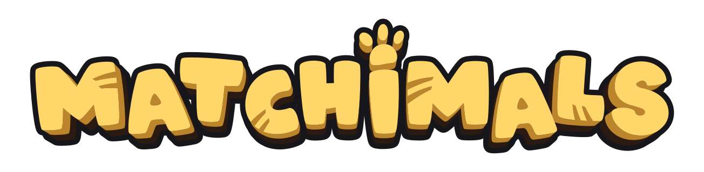
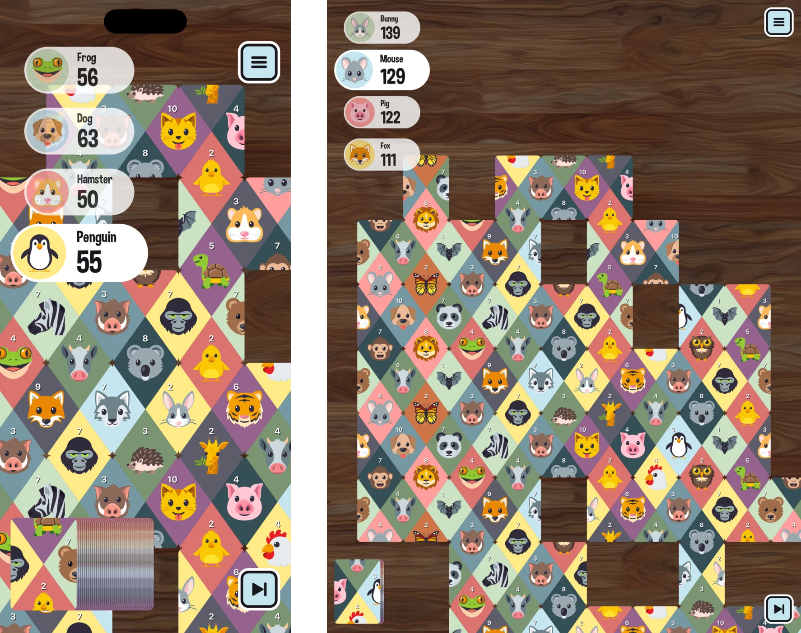

# Matchimals.fun

## an animal matching puzzle card game 🦁 🃏

#### [🍎 Download for iOS from the App Store](https://itunes.apple.com/app/id1348821168)

#### [🖥 Play on desktop on the web](https://www.matchimals.fun/)



## How to play

1.  1-4 players take turns connecting the top card from the deck to the existing cards on the table.
1.  If there isn't a valid connection to be made, then the player must pass.
1.  The game ends when all the cards from the deck have been connected on the board.

## About

Matchimals.fun was built as a proof-of-concept by Chris Heninger ([@chrisheninger](https://github.com/chrisheninger)) and Hannah Heninger ([@mshannahnv](https://github.com/mshannahnv)). The gameplay is inspired by a 1959 card game called Busy Bee. 🐝 🃏

Matchimals.fun is made for kids of all ages. It aims to provide entertainment and improve pattern recognition skills through fun visuals of animals, colors, and numbers.

This project is sponsored by [iGravity Studios](https://igravitystudios.com)– a custom software shop with an emphasis on UI/UX development– based in Phoenix, Arizona. 🏜 ❤️

## Want to contribute?

This game has been made open source to help others looking to learn more about JavaScript, BoardGame.io, and React-Native applications.

Find a bug or have a question? Feel free to [open an issue](https://github.com/chrisheninger/matchimals.fun/issues) or [submit a pull request](https://github.com/chrisheninger/matchimals.fun/pulls)!

### Development

This is an [Expo](https://expo.dev) app using [continuous native generation](https://docs.expo.dev/workflow/continuous-native-generation/) — the `ios/` directory is generated from `app.json` and not checked in. You'll need [bun](https://bun.sh), Xcode, and CocoaPods installed.

1.  Fork the repo
1.  Install dependencies: `bun install`
1.  Build and run the app in the iOS simulator: `bun run ios`
1.  Or run the web version: `bun run web`

The app icons are rendered from the animal SVGs: `bun run generate:icons` regenerates the primary icon, the per-animal alternate icons (pick one under Settings on iOS), and the web icons — commit the output.

Screenshots for the App Store and this README come from the simulator: `bun run screenshots` builds a Release app, then boots an iPhone 14 Plus (App Store Connect's required 6.5" iPhone slot, 1284 × 2778 px) and an iPad Pro 13-inch (the 13" slot, 2064 × 2752 px) and, for every storefront language, plays a two-player game on the iPhone and a four-player game on the iPad — the five board snapshots in `src/Matchimals/snapshots.ts` followed by the victory card, with the fixed players from `src/screenshots.ts`, each reached through a `https://www.matchimals.fun/?screenshot=<state>` universal link. Numbered PNGs land in `screenshots/<storefront>/<display>/` in upload order (the storefront folders use App Store Connect's locale codes, like `store/metadata/`) — commit them; they are what gets uploaded to App Store Connect. Add `--skip-build` to reuse the last build, or `--locales "en-US ja"` for a subset.

Captions go on afterwards: `bun run screenshots:caption` lays every caption set in `store/captions/` (`family`, `travel`, `no-ads` — display → state → storefront locale → text, two lines at most, set in Dimbo) over those screenshots, setting each one under the caption on the main menu's trianglify background (`--frame card|bleed|slide` picks how: a sticker card, edge to edge, or a slide with rounded top corners — `card` unless asked), and writes `screenshots-captioned/<set>/<storefront>/<display>/` at the same slot sizes, recording the frame in `screenshots-captioned/<set>/frame.json` so a set is never a mix of two — commit those too. `bun run asc:listing --screenshots-dir screenshots-captioned/family` puts a captioned set on the main listing (`--dry-run` shows what would change); captioning needs ImageMagick (`brew install imagemagick`).

### Languages

The app follows the device language: English, Spanish (Spain and Latin America), Brazilian Portuguese, German, French, Italian, Japanese, Korean and Simplified Chinese. Every user-facing string lives in `src/locales/<locale>.ts` — English is the source of truth and defines the `Translations` interface, so a missing key in any language is a type error — and components read them through `t()`, `caps()` (titles and buttons are capitalized at render, with the locale's rules), `playersLabel()` and `animalName()` from `src/i18n.ts`. Animal names are translated only at render: the English `AnimalName` stays the key everywhere (state, app icons, screenshot links). The display font Dimbo only has Latin glyphs, so `displayFont` resolves to the platform font (at a weight to match) for Japanese, Korean and Chinese.

- `bun run check:locales` fails on a missing key, a placeholder mismatch, a character Dimbo can't draw, or a string that overflows a fixed-width slot (measured in Dimbo), and checks `store/metadata/` against App Store Connect's limits.
- `bun run screenshots:locales` photographs every language on the iPhone and iPad simulators (main menu, Settings, the longest animal names on the nameplates and the victory card, the in-game menu, the animal chooser) into `build/locale-screenshots/`, with a contact sheet per language.
- `bun scripts/translations-review.mjs` regenerates `store/translations-review.md`, every string beside its English source for native speakers to review.

To add a language: copy `src/locales/en.ts`, register it in `src/locales/index.ts` (and in `resolveLocale`'s fallbacks if a bare language should map to it), add it to `CFBundleLocalizations` in `app.json`, create `store/metadata/<App Store locale>/`, then run the three commands above. The App Store listing for each storefront (name, subtitle, keywords, promotional text, description, release notes) is kept in `store/metadata/` and pasted into App Store Connect by hand.

### Deploying to TestFlight

iOS releases are built and uploaded entirely locally (no EAS subscription or fastlane required):

```bash
bun run deploy:ios
```

The script (`scripts/deploy-ios.sh`) auto-increments `ios.buildNumber` in `app.json` (and commits the bump), runs `expo prebuild`, archives with `xcodebuild`, uploads the build straight to App Store Connect, then tags the commit (`ios-v<version>-<build>`) and pushes. It refuses to run unless you're on a clean `main` and the typecheck passes. If the upload step fails, fix the cause and run `bun run deploy:ios --upload-only` to re-upload the archive it already built. App version bumps (`expo.version`) are still manual — edit `app.json` before deploying a new release.

Signing and the upload authenticate with an App Store Connect API key if one is installed on the Mac: `~/.private_keys/matchimals-asc.env` sets `ASC_KEY_ID` and `ASC_ISSUER_ID`, and the key's `AuthKey_<id>.p8` sits beside it (ASC → Users and Access → Integrations → App Store Connect API; the App Manager role is enough). Without one, the Apple ID signed into Xcode (Xcode → Settings → Accounts) is used for the team in `app.json` — that session lapses after a few hours, which is the usual reason an upload fails. Xcode creates the certificates and profiles it needs either way. Nothing secret is stored in the repo.

The web version deploys automatically via Netlify when `main` is pushed (`bun run build:web` for a local static export to `dist/`).

## Special thanks

[Nicolo Davis](https://github.com/nicolodavis) and collaborators for the turn-based game engine [boardgame.io](https://github.com/nicolodavis/boardgame.io).

Facebook and collaborators for the wonderful libraries [React](https://reactjs.org/) and [React-Native](https://facebook.github.io/react-native/).
